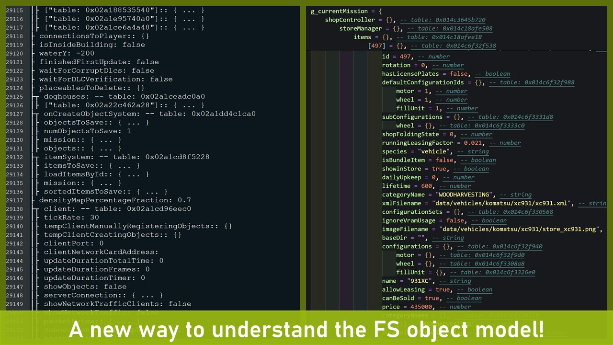

# DEVELOPER POWERTOOLS
[Download](https://www.farming-simulator.com/mod.php?mod_id=303447&title=fs2025)

Developer PowerTools is a quality-of-life mod for modders that works well alongside Power Tools, Easy Dev Controls, Global Explorer and similar mods. 

An improved style of visualizing in-game tables, together with the posibility to save tables to well-formed Lua files, opens up a new way of understanding the FS object model!

### Features
- New console commands to restart the game (see below for details)
- Console command to print Lua table contents to either the console/log or a separate file
- Console command to clear the log file

### Console Commands
- [NOTE*] dtRestart (or `r`): Restarts the game client using a soft restart (slightly faster than a hard reset)
- [NOTE*] dtRestartHard (or `rr`): Performs a hard reset (this will ensure everyhing is unloaded from memory)
- dtTable: Prints the contents of a Lua table to the console/log
- dtSaveTable: Save the contents of a Lua table to a file (3-4x times faster than printing a table to the log)
- dtVisualizeTable [beta]: An improved way of printing tables to the log, both faster, more memory efficient and visually improved.
- dtClearLog (or `cls`): Clears the log.txt file to get a fresh log (especially useful when using the restart command)

*NOTE: Due to new limitations in FS25 automatic restart of current savegame is disabled until Giants re-enables this feature.

#### Caution
The console commands to restart the game will do this -without- asking you to save your progress first. I.e. you risk loosing progress if you are not cautious!

### Saving Tables
The `dtSaveTable` allows you to quickly dump a Lua table to disk in a well formatted Lua file, meaning you can load this file as a source file in the Lua interpeter or in-game. This has several uses cases, especially to understand the FS object model.

Optionally you can choose the depth of the output, especially important when saving top level tables (e.g. g_currentMission) that may contain many child tabled and/or large tables. Thanks to a well optimized code it is still possible to save g_currentMission with some 5-6 levels of depth before the Lua engine starts to leak memory and becomes unstable (the default depth is set to 2).

Example:
To dump the g_currentMission table to a file you could use the command `dtSaveTable g_currentMission currentMission.lua 1`. This would export the g_currentMission table to a file named `currentMission.lua` and only including the direct descendants of g_currentMission. 

Note: due to security restrictions, the generated .lua file will be stored in your `My Games/FarmingSimulator2025/modSettings/FS22_000_DevTools` folder. 

### Printing Tables
Similar to `dtSaveTable`, the command `dtTable` can be used to output a table to the log. It takes the table name as mandatory parameter and the maxDepth as an optional parameter (with a default value of 2).

Important! Due to the nature how FS prints to the log it is only recommended to fairly small tables and/or shallow structures (depth should not exceed 2-3). E.g. printing g_currentMission to the console with a depth of 4 will make FS consume some 10-15GB of system ram and then crash in a out-of-memory error. 

If you need to print a deeper structure it is recommended to use `dtSaveTable`.

## [Want to report a bug or have a great idea?](https://github.com/w33zl/FS25_DevTools/issues/new/choose)
If you want to report a bug or submit an suggestion, please first check the [list of existing issues](https://github.com/w33zl/FS25_DevTools/issues) to ensure that you are not adding duplicates (this just consumes my time that could be spent on improving the mods). When you have ensured that your issue is not already reported, you can create a [bug report](https://github.com/w33zl/FS25_DevTools/issues/new?template=bug_report.md) or a [feature request](https://github.com/w33zl/FS25_DevTools/issues/new?template=feature_request.md).

## [Download](https://www.farming-simulator.com/mod.php?mod_id=303447&title=fs2025)

* Download [Developer PowerTools](https://www.farming-simulator.com/mod.php?mod_id=303447&title=fs2025)
* Download [PowerTools](https://www.farming-simulator.com/mod.php?mod_id=303451&title=fs2025)

To download my other mods, please visit my FS19, FS22 or FS25 page on the official Giants ModHub page:

## Like the work I do?
I love to hear you feedback so please check out my [Facebook](https://www.facebook.com/w33zl). If you want to support me you can become my [Patron](https://www.patreon.com/wzlmodding) or buy me a [Ko-fi](https://ko-fi.com/w33zl) :heart:

> _By interacting with me and supporting me on these platforms, you help me stay motivated to create new mods and make the publicly available. Any monetary support also helps me towards my dream; to spend more time on making mods for Farming Simulator instead of my current day job (as everyone else, I need to finance my IRL life some way or other)._

 

